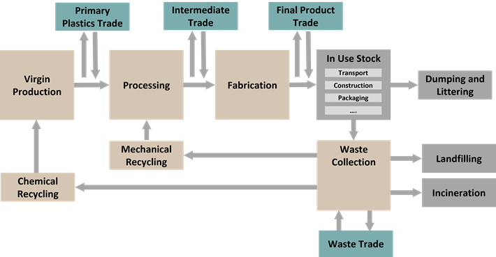
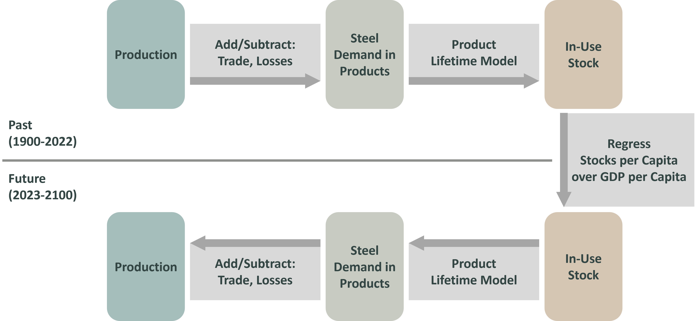

# Methodology

## Concept
Material Flow Analysis (MFA) is a systematic approach to quantifying and analysing the flows and stocks of materials within a defined system, such as a city, region, or entire economy. Central to MFA is the concept of social metabolism, which treats societies as metabolic systems that extract materials from the environment, transform them through economic processes, and eventually release wastes and emissions. In MFA, mass balancing ensures that all material inputs, outputs, and accumulations are accounted for according to the conservation of mass principle. These flows and stocks are represented as multi-dimensional arrays, capturing variations across time, region, material type, element, product, and more [@pauliuk_general_2015].  
REMIND-MFA includes MFA models for the basic materials cement, plastics, and steel (see the [scope](scope.md) for further details). The figures below show the layouts of the three models including processes and stocks and their linkage through flows. Processes are coloured brown, stocks are grey, and trade is green. The layout is similar across materials, centred around the in-use stock and the material production and fabrication leading up to it. Trade occurs at several steps throughout the life cycle for each material. Recycling flows differ among models. Cement has some unique properties, with limited recycling and negligible product and scrap/waste trade. The flow charts are somewhat simplified. For the full definition of each MFA system including the dimensionality of each stock and flow, refer to the respective sections.

*Figure 1: Process and flow layouts of the REMIND-MFA for steel*

*Figure 2: Process and flow layouts of the REMIND-MFA for plastics*

## Dynamic Stock Modelling: Top-Down Approach
Dynamic stock modelling is an essential extension of MFA, providing a way to track how materials accumulate in long-lived goods like buildings, infrastructure, and vehicles [@Deng23]. Lifetime models further enrich this picture by quantifying how long materials remain in use before leaving the in-use stock again. They do this via a probability density function of product lifetimes, which determines the share of goods from a certain production year which leave the stock again by a certain time.  
There are two approaches to derive in-use stocks in material flow analyses: Bottom-up and top-down. In the bottom-up approach, in-use stocks are quantified for specific products or end-use sectors in which the material of interest is used, and the material in-use stock is calculated as the sum of their respective material contents. While this approach has a high granularity and allows to model product- or end-use sector specific circular economy (CE) measures in great detail, typically not all end-use sectors can be covered, and hence, not the total material demand is modelled.   
In REMIND-MFA, we therefore employ a top-down approach where in-use stocks are derived from statistical data on total material production and sector splits, i.e. statistics on the share of materials that is used within the different end-use sectors.

## Stock-Driven Demand Projection
One key question in prospective material flow analysis is the modelling of future material demand.
Models can be either inflow-driven or stock-driven. In inflow-driven models, demand is modelled first and drives future developments of the in-use stock together with the lifetime model. Stock-driven models, on the other hand, assume that the in-use stock of a material is what provides a service to society, and is therefore the quantity that should be projected as a function of time or GDP, and material demand should be derived from stock change and stock replenishment [@Haberl17; @Lauinger21; @Pauliuk16].  
In REMIND-MFA, we choose such a stock-driven approach, in line with relevant literature in the field [@pauliuk_steel_2013]. We use this method to derive a baseline scenario without circular economy (CE) interventions. We assume in-use stock per capita to be a function of GDP per capita (GDPpC). In particular, we assume it to behave like a logit function of the logarithm of GDPpC, which is in line with historic trends. Using historic production and trade data, we calculate historic demand, and using product lifetime models we derive the historic in-use stock development. We regress these historic stocks over GDP to derive the regression parameters for future stock developments. We do this for separate in-use stocks in different product categories, which then add up to the total in-use stock. For each product category, we regress a common set of parameters for all regions. However, since historic data in single regions deviates from these curves, we apply region-dependent correction terms, which form a smooth transition from historic trends to the common regression. Scenarios with CE interventions are derived from the baseline scenario by adjusting the regress parameters (such as stock saturation levels) or the input parameters (such as lifetimes or recycling rates), or by modifying material demands after regressing them.

*Figure 3: Projecting Future Steel Production: Stock Saturation (method adapted from [@pauliuk_moving_2012])*

## Trade
REMIND-MFA includes trade in different stages across the life cycle. Those are raw material trade, trade of materials embedded in goods, and trade of end-of life scrap or waste. Material-specific exceptions apply.
There are two different methods for modelling of future trade: by simple extrapolation or as price-sensitive trade.  
In the simple extrapolation, future trade is modelled as a function of two terms: a fixed fraction of supply or demand of the material at the specific stage (e.g., scrap exports as a fraction of scrap supply), and the absolute trade volumes in the last historic year. In particular, the square root of the product of both was applied. Imports and exports were then scaled in a second step, such that global imports and exports are equal, i.e., that international trade markets clear. Trade is modelled as a pool trade here, i.e., the trade flows of each region have no shares of trade partners defined.  
Apart from this, an early version of a price-sensitive trade module was implemented. This model is based on a logit discrete-choice model, with the choices of imports from different regions, or domestic production. The model reacts to temporally changing supply curves (i.e., price structures) in different regions by adjusting trade shares, but it never fully chooses only one option, which corresponds to patterns seen in practice due to heterogeneity of the traded products. Cost penalties for trade are implemented and calibrated to historic data. The implemented cost curves are so far synthetic but will in the future be provided by REMIND IAM. This price-sensitive trade module is used only in the steel MFA model so far.
