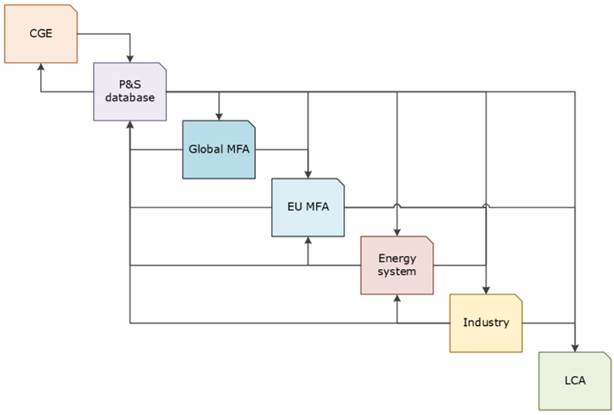

# Integration into MIC3

The model interconnections within MIC3 are shown in Figure 1. These relationships are described in detail in [D3.3 and D3.4 of the project](https://www.transience.eu/publications/deliverables).
The trade flows of REMIND-MFA are delivered especially to the [EU-MFA](https://transience-eu-mfa.readthedocs.io/) module. REMIND-MFA material flows within Europe are harmonised with those delivered by the EU-MFA module. This enables MIC3 to anchor its European scenarios within a broader international system, accounting for interregional dynamics and trade-related impacts on competitiveness, imports, and exports.

*Figure 1: Planned interfaces in the MIC3 baseline workflow*

## Inputs from other modules
| Parameter                                   | Source   | Description                                                                                                   |
|---------------------------------------------|----------|---------------------------------------------------------------------------------------------------------------|
| GDP                                         | OPEN-GEM | As an overarching driver for material demand within the EU region |
| Trade flows                                 | OPEN-GEM | For harmonization of trade flows between OPEN-GEM and REMIND-MFA (requires translation between monetary values and tonnages) |
| EU material demands and other parameters (tbd) | EU-MFA   | For harmonization of flows between EU-MFA and EU region in REMIND-MFA                                         |
| Production costs (shadow prices)            | ITOM     | Eventually for calculating price-sensitive trade (currently planned to use prices from REMIND)                |

## Outputs to other modules
| Parameter                                   | Sink     | Description                                                                                                   |
|---------------------------------------------|----------|---------------------------------------------------------------------------------------------------------------|
| Trade flows                                 | EU-MFA   |   |
| Trade flows                                 | OPEN-GEM | For harmonization of trade flows between OPEN-GEM and REMIND-MFA (requires translation between tonnages and monetary values) |