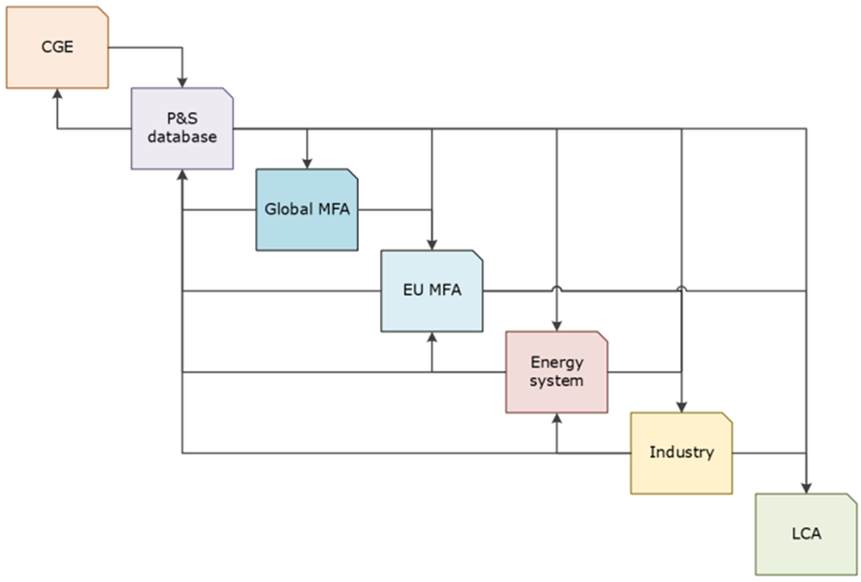

# Integration into MIC3

The model interconnections within MIC3 are shown in Figure 1. These relationships are described in detail in [D3.3 and D3.4 of the project](https://www.transience.eu/publications/deliverables).
The trade flows of REMIND-MFA are delivered especially to the [EU-MFA](https://transience-eu-mfa.readthedocs.io/) module. REMIND-MFA material flows within Europe are harmonised with those delivered by the EU-MFA module. This enables MIC3 to anchor its European scenarios within a broader international system, accounting for interregional dynamics and trade-related impacts on competitiveness, imports, and exports.


*Figure 1: Planned interfaces in the MIC3 baseline workflow*

## Inputs from other modules
| Parameter                                   | Source   | Description                                                                                                   |
|---------------------------------------------|----------|---------------------------------------------------------------------------------------------------------------|
| GDP                                         | OPEN-GEM | As an overarching driver for material demand within the EU region |
| Trade flows                                 | OPEN-GEM | For harmonization of trade flows between OPEN-GEM and REMIND-MFA (requires translation between monetary values and tonnages) |
| EU material demands and other parameters (tbd) | EU-MFA   | For harmonization of flows between EU-MFA and EU region in REMIND-MFA                                         |
| Production costs (shadow prices)            | ITOM     | Eventually for calculating price-sensitive trade (currently planned to use prices from REMIND)                |

## Outputs to other modules
| Parameter                                   | Sink     | Description                                                                                                   |
|---------------------------------------------|----------|---------------------------------------------------------------------------------------------------------------|
| Trade flows                                 | EU-MFA   |   |
| Trade flows                                 | OPEN-GEM | For harmonization of trade flows between OPEN-GEM and REMIND-MFA (requires translation between tonnages and monetary values) |

## Coupling with the ATLAS trade model

Trade is normally extrapolated from historic trade (`TradeExtrapolator`). Alternatively, it can be
calculated by the ATLAS trade model, which needs the material demand of REMIND-MFA as input.

Make sure you have `pixi` installed (e.g., `curl -fsSL https://pixi.sh/install.sh | sh`).

Run the complete workflow with the MFA-ATLAS-MFA coupling:

```bash
uv run atlas.py couple --model steel
```

`couple` runs MFA with `default,atlas_run1`, copies demand to the data pipeline, runs the ATLAS data pipeline, calibration, validation, and the ATLAS future model, transfers the resulting trade, then runs MFA
with `default,atlas_run2`.

Each stage can also be retried or run independently:

```bash
# Run the first MFA stage
uv run atlas.py run-mfa --model steel --stage one
# Copy the generated demand trajectories to the ATLAS data pipeline
uv run atlas.py copy-demands --model steel
# Run the ATLAS data pipeline to generate trade flows
uv run atlas.py preprocess
uv run atlas.py calibrate
uv run atlas.py validate
uv run atlas.py future
# Copy the generated trade flows back to REMIND-MFA
uv run atlas.py copy-trade
# Run the second MFA stage with the new trade flows
uv run atlas.py run-mfa --model steel --stage two
```

Note: `future` and `couple` accept a few options to control the ATLAS variant, CO2 price, and PkBudg scenario. See `atlas.py future --help` for details. If you pass any of these options, you must also pass them to `copy-trade` so that the correct ATLAS cache is read.

A few more details on the coupling:

1. `uv run remind_mfa.py --config default --config atlas_run1 --model steel` writes the material
   demand of the traded product to `<export.path>/atlas/` (`steel_demand.csv` per region and year,
   `plastics_demand.csv` additionally per type and material). Trade is extrapolated in this run.
2. ATLAS is run on that demand, and its trade output is converted to the input data format of
   REMIND-MFA, i.e. to one `.cs4r` file per market and trade direction in the input data folder:

    | Model    | Market    | Files                                                          |
    |----------|-----------|----------------------------------------------------------------|
    | steel    | `steel`   | `st_trade_steel_imports.cs4r`, `st_trade_steel_exports.cs4r`     |
    | plastics | `primary` | `pl_trade_primary_imports.cs4r`, `pl_trade_primary_exports.cs4r` |

    The files carry the dimensions of the corresponding trade market in their header line, i.e.
    `* note: dimensions: (Time,Region,value)` for steel and
    `* note: dimensions: (Time,Region,Type,Material,value)` for plastics.

3. `uv run remind_mfa.py --config default --config atlas_run2 --model steel` reads those files
   instead of extrapolating trade (`trade.source = "data"`). Historic years still use the trade of
   the historic MFA, so only future years come from ATLAS. Global imports and exports of the data
   are balanced (`trade.balance`).

By default, only the primary market of each material is read from data. Other markets (e.g. steel
scrap or indirect trade) can be added with `trade.data_markets`.
